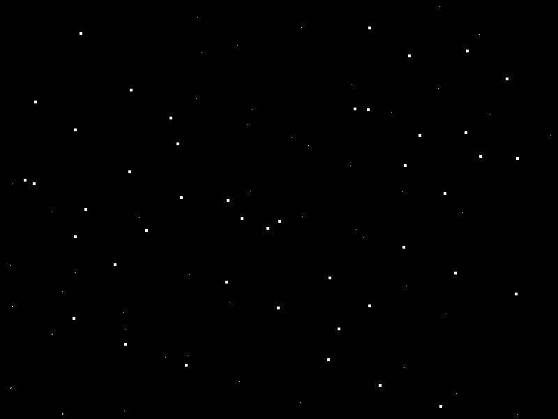

# Moon Grandpa #

by Andrew Dempsey ([andrewdempsey2016@gmail.com](andrewdempsey2016@gmail.com))

**Controls**

Left/Right Arrow - Fly left/right
Space Key - Ascend

Defeat aliens!
----------
Get grandpa to the moon!
----------
Built built using SFML

[https://www.sfml-dev.org/](https://www.sfml-dev.org/)
----------
Compiled with MinGW

[http://www.mingw.org/](http://www.mingw.org/)
----------
## Dependencies ##

The following DLL's are required to run the program:

- libgcc_s_dw2-1.dll
- libstdc++-6.dll
- libwinpthread-1.dl
- openal32.dll
- sfml-audio-2.dll
- sfml-graphics-2.dl
- sfml-network-2.dll
- sfml-system-2.dll
- sfml-window-2.dll
